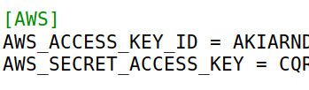
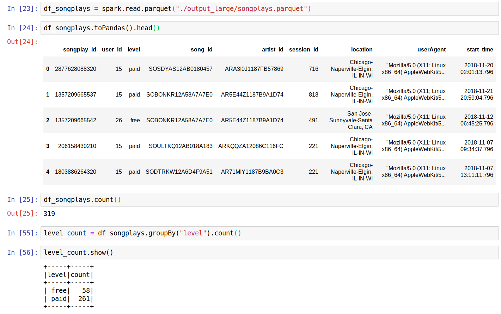
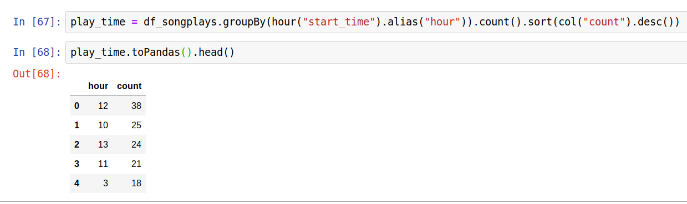

# Build Data Lake from Muisc Streaming Data

## Introduction

Sparkify is a startup company that collects user song play and song data as JSON files via its music streaming app. Theie goal is to to understand what songs users are listening to.

They want to create data Lake using Spark-HDFS as the choice of the tools and save the resuting tables/dataframes in distributed parquet format. So, data analysts can access and read these files very fast for further queries and analysis. I will Spark to ingest data, and select right data to create tables following the dimensional model (star schema) that is optimized for joining tables and analytical queries.

## Data Lake

Data lakes are design to handle different types of data including unstructure data. Schemas of data are often not pre-defined. This provides the flexibility to create specific schemas for specific analytic purpose while reading the data. Therefore, data lakes collect all kinds of data in structural or unstructural forms. Data are later transformed to create tables/data frames for analyses.  

Spark, Hadoop file system (HDFS) and other tools (MapReduced, Hive, Impala etc) provide big data tools to handle big data in data lakes. Spark and Hadoop make it easier to handle large raw data as easy as handling data in databases. Big data processing clusters such as AWS EMR provide the scale needed for processing big data. Spark also provides tools to create schema and tables on the read for data analytics.  

Data lakes can be created locally or at cloud.  We can run local instances of Spark and save output files locally or cloud such as AWS S3 storage.  They can also be created at cloud with AWS EMR clusters which can run multiple copies of Spark-HDFS instances or Spark instances connecting to S3 or AWS serverless Athena. For this project, I run Spark locally and save output tables/dataframes as parquet files to AWS S3 storage.  

## Steps for the project 

### (1) AWS configuration file 

An AWS configuration file contains AWS_ACCESS_KEY_ID and AWS_SECRET_ACCESS_KEY which are required for connecting to AWS services.  The keys were in dl.cfg file and used to run etl.py.  The picture shows the truncated key codes. The keys are deleted in submitted dl.cfg file for secrurity reason.  

### (2) etl.py

etl.py contains the program that can be used to extract data from song_data and log_data at s3 storage, then transform data to create tables.  Tables are later saved in distribute paquet files.  The detail steps are listed below.

#### (a) Import required libraries for running the program.

#### (b) Create Spark instance. 

#### (c) Run etl.py 

(1) I run Spark locally with data from "s3a://udacity-dend/song_data/A/A/A/\*.json" and "s3a://udacity-dend/log_data/2018/11/\*.json", save the result to my S3 storage s3a//jun-data-lake/. 

When I run with "s3a://udacity-dend/log_data" and "s3a://udacity-dend/song_data", it was extremely slow. I didn't finish.  

(2) I copied "s3a://udacity-dend/log_data" and "s3a://udacity-dend/song_data" to my local drive (with "aws s3 sync s3-directory local-directory" method).  I run etl.py on the datasets ("s3a://udacity-dend/log_data" and "s3a://udacity-dend/song_data") locally and save the tables as parquet files. 

    

## Example queries and results

The parquet files were from etl.py run on the whole datasets locally.  

### (1) How many times songs were played by paid and free users in songplays table?   

### (2) What are top 5 song playing hours in songplays table ? 

